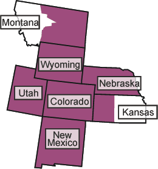

# Regis University will host the 2023 Regional Meeting March 24-25. [Find the CfP, due November 28, here!](https://iliff.github.io/rmgp/RMGP2023CFP.docx)

The Rocky Mountains-Great Plains region was formerly a region of both the [American Academy of Religion](http://aarweb.org) and the Society of Biblical Literature. In 2022, the SBL abolished their regions and withdrew financial support from regional organizations. The RMGP remains a region of the AAR and invites scholars of all fields of religion and religious textual studies (including biblical studies) to our regional meeting regardless of organizational affiliation.

## Participating Area

Our region includes Colorado, Nebraska, New Mexico, Utah, Wyoming, western Kansas (67400-67999), and eastern Montana (59000-59399, 59500-59599).

## Regional Officers

President: [Dheepa Sundaram](mailto:dheepa.sundaram@du.edu), University of Denver

Vice President and Program Chair: [Amy Balogh](mailto:abalogh@regis.edu), Regis University

Secretary and Treasurer: [Zachary B. Smith](mailto:zacharybsmith@creighton.edu), Creighton University

AAR Coordinator: Jeremy Fricke, Tri-Faith

AAR Student Director: Michael Laminack, University of Denver and Iliff School of Theology

## Past Presidents

Jeffrey Scholes, University of Colorado Colorado Springs (2021-2022)

Ronald A. Simkins, Creighton University (2019-2020, 2020-2021)

Lincoln Blumell, Brigham Young University (2018-2019)

Elias Sacks, University of Colorado Boulder (2017-2018)

Pamela Eisenbaum, Iliff School of Theology (2016-2017)

Ronald A. Simkins, Creighton University (2015-2016)

Andrea Stanton and Gregory Robbins, University of Denver (2014-2015)

Richard S. Hess and Sung Wook Chung, Denver Seminary (2013-2014)

Dan Belnap, Brigham Young University (2012-2013)

Jacob Kinnard, Iliff School of Theology (2011-2012)

Ronald A. Simkins, Creighton University (2010-2011)

Randolph F. Lumpp, Regis University (2009-2010)

Richard Hess and Hélène Dallaire, Denver Seminary (2008-2009)

Nicolae Roddy, Creighton University (2007-2008)

David L. Weddle, The Colorado College (2006-2007)

Carl A. Raschke, Denver University (2005-2006)

Thomas A. Wayment, Brigham Young University (2004-2005)

Lynn Ross Bryant, University of Colorado, Boulder (2003-2004)

John O'Keefe, Creighton University (2002-2003)

Mark George, Iliff School of Theology (2001-2002)

Randolph F. Lumpp, Regis University (2000-2001)

Tazim Kassam, Colorado College (1999-2000)

Ronald A. Simkins, Creighton University (1998-1999)

Harris Lenowitz, University of Utah (1997-1998)

## Student Representatives

The AAR has a regional student position that addresses the needs and concerns of graduate students and promotes their professional development and participation in our regional organization:

[AAR Graduate Student Committee](https://www.aarweb.org/node/108)

Student Representatives serve the regional and national organization of AAR. As such, the region would like to offer their financial support:

Student Representatives have a waived registration fee for the regional meeting. They should contact the meeting organizer as soon as possible when registration opens to arrange this.
Student Representatives are required to pursue funding from the university with which they are affiliated before they submit requests to the region. If no such funding is available, student representatives should indicate this when requesting financial support.
Student Representatives may submit costs for hotel rooms, airfare, and food. The region requires that reimbursements for hotel rooms will be made at the AAR rate that is published by the national organization for the annual meetings, that airfare must be coach/economy, and food will not be reimbursed higher than the annual federal per diem rates. The same requirements will apply to the regional meeting. Financial support is capped at $500 for each student representative for an academic year (one national and one regional meeting).
To receive financial support, student representatives must submit (1) itemized receipts for all costs for which they are requesting reimbursement and (2) a list of funding resources for which they have applied at their home universities (or a statement that no such funding is available) within 60 days of each meeting.
Student Representatives are expected to make every reasonable effort to be present to report on their activities at the Regional Business Meeting (scheduled each Spring at the regional meeting). 
Please contact the [current president](https://iliff.github.io/rmgp/#regional-officers) for more information.

## Regions Forum 2018

These links are the ones Elizabeth Coody referenced at the Regions Forum at the 2018 AAR/SBL Annual Meeting in Denver, Colorado where regional coordinators, officers, and representatives shared and discussed regional meeting innovations.

Katherine Downey, Dallas, TX, Presiding
Sunday, November 18, 2018 - 1:00 PM-3:00 PM
Convention Center-604 (Street Level)

#### Digital Humanities: Virtual Reality, Natural Language Processing, Machine Learning, and Artificial Intelligence

[Virtual Scriptures](http://www.virtualscriptures.org)

[A Century of Black Mormons](http://www.centuryofblackmormons.org)

[Experimental Humanities](https://www.iliff.edu/experimental-humanities/)

This rmgp.org website was created by Elizabeth Coody (2016-19 AAR Regional Coordinator for the RMGP) and is maintained by Zachary B. Smith, AAR Regional Coordinator for the RMGP Region. If you have questions, additions, or corrections to the website, please [contact me](mailto:zacharybsmith@creighton.edu).
        

