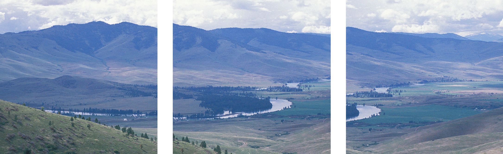
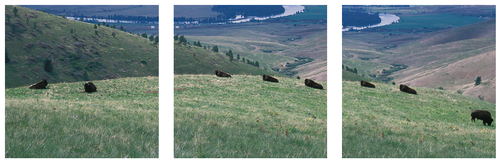

# The 2024 RMGP Regional Meeting will be hosted by Brigham Young University (Provo, UT), March 22-23, 2024! 
[Click here](https://www.dropbox.com/scl/fi/hxba9c0rw38hxasciw6kr/AAR-RBS-RMGP-CFP-2024.pdf?rlkey=w377frfxseqdpf358ndzn28vn&dl=0) for the Call for Proposals (due Nov. 27, 2023).

The Religion & Bible Society of the Rocky Mountain Great Plains Region (RBS) was formerly the Rocky Mountain-Great Plains Region of both the [American Academy of Religion](http://aarweb.org) and the Society of Biblical Literature. In 2022, the SBL abolished their regional structure and withdrew financial support from regional organizations. However, those of us in RMGP remain committed to our region, the scholarship we do, and the important professional development opportunity that the RMGP Regional Meeting has become.
The Religion & Bible Society was incorporated November 3, 2022, in the state of Colorado and was granted federal 501(c)3 status December 16, 2022. At this time, it serves the same functions as the former AAR/SBL regions (AAR maintains its regional structure), with a slightly modified leadership structure that will allow the Religion & Bible Society to expand opportunities for scholars in the RMGP Region, especially its junior and student scholars.

President: Amy L. Balogh, Regis University

Vice President: Dheepa Sundaram, University of Denver

Interim Secretary & Treasurer: Zachary Simpson, University of Science & Arts of Oklahoma

Conference Coordinator: George Pierce, Brigham Young University

RBS Board Members: George Pierce (Brigham Young Univ.), Zachary Simpson (Univ. of Science and Arts of Oklahoma), Andrea Stanton (Univ. of Denver), Michelle Stinson (Denver Seminary)

AAR Coordinator: Jeremy Fricke, Tri-Faith Initiative

AAR Student Director: Michael Laminack, University of Denver and Iliff School of Theology

## Future Meetings:

March 22-23, 2024 - Brigham Young University, Provo UT

April 4-5, 2025 - Denver Seminary, Denver CO

2026 - Host TBA

2027 - University of Colorado - Colorado Springs, Colorado Springs CO

## Participating Area

Our region primarily, though not exclusively, serves individuals and institutions in Colorado, Nebraska, New Mexico, Utah, Wyoming, and Kansas. Historically, independent scholars and members of the American Academy of Religion (AAR), American Society of Overseas Research (ASOR), and Society of Biblical Literature (SBL) professional organizations have served as the heart of regional involvement, include in meeting attendance and presentation and in organizational leadership. Hosting institutions have included Brigham Young University (UT), Colorado College (CO), Creighton University (NE), Denver Seminary (CO), Iliff School of Theology (CO), Regis University (CO), University of Colorado Boulder (CO), University of Colorado Colorado Springs (CO), University of Denver (CO), and University of Utah (UT); leadership has also come from the Tri-Faith Initiative (NE) and University of Science and Arts of Oklahoma (OK).

## Past AAR/SBL Regional Presidents

Dheepa Sundaram, University of Denver (2022-2023)

Jeffrey Scholes, University of Colorado Colorado Springs (2021-2022)

Ronald A. Simkins, Creighton University (2019-2020, 2020-2021)

Lincoln Blumell, Brigham Young University (2018-2019)

Elias Sacks, University of Colorado Boulder (2017-2018)

Pamela Eisenbaum, Iliff School of Theology (2016-2017)

Ronald A. Simkins, Creighton University (2015-2016)

Andrea Stanton and Gregory Robbins, University of Denver (2014-2015)

Richard S. Hess and Sung Wook Chung, Denver Seminary (2013-2014)

Dan Belnap, Brigham Young University (2012-2013)

Jacob Kinnard, Iliff School of Theology (2011-2012)

Ronald A. Simkins, Creighton University (2010-2011)

Randolph F. Lumpp, Regis University (2009-2010)

Richard Hess and Hélène Dallaire, Denver Seminary (2008-2009)

Nicolae Roddy, Creighton University (2007-2008)

David L. Weddle, The Colorado College (2006-2007)

Carl A. Raschke, Denver University (2005-2006)

Thomas A. Wayment, Brigham Young University (2004-2005)

Lynn Ross Bryant, University of Colorado Boulder (2003-2004)

John O'Keefe, Creighton University (2002-2003)

Mark George, Iliff School of Theology (2001-2002)

Randolph F. Lumpp, Regis University (2000-2001)

Tazim Kassam, Colorado College (1999-2000)

Ronald A. Simkins, Creighton University (1998-1999)

Harris Lenowitz, University of Utah (1997-1998)

## Student Representatives

The AAR has a regional student position that addresses the needs and concerns of graduate students and promotes their professional development and participation in our regional organization:

[AAR Graduate Student Committee](https://www.aarweb.org/node/108)

Student Representatives serve the regional and national organization of AAR. As such, the region would like to offer their financial support:

Student Representatives have a waived registration fee for the regional meeting. They should contact the meeting organizer as soon as possible when registration opens to arrange this.
Student Representatives are required to pursue funding from the university with which they are affiliated before they submit requests to the region. If no such funding is available, student representatives should indicate this when requesting financial support.
Student Representatives may submit costs for hotel rooms, airfare, and food. The region requires that reimbursements for hotel rooms will be made at the AAR rate that is published by the national organization for the annual meetings, that airfare must be coach/economy, and food will not be reimbursed higher than the annual federal per diem rates. The same requirements will apply to the regional meeting. Financial support is capped at $500 for each student representative for an academic year (one national and one regional meeting).
To receive financial support, student representatives must submit (1) itemized receipts for all costs for which they are requesting reimbursement and (2) a list of funding resources for which they have applied at their home universities (or a statement that no such funding is available) within 60 days of each meeting.
Student Representatives are expected to make every reasonable effort to be present to report on their activities at the Regional Business Meeting (scheduled each Spring at the regional meeting). 
Please contact the [current president](https://iliff.github.io/rmgp/#regional-officers) for more information.

This rmgp.org website was created by Elizabeth Coody (2016-19 AAR Regional Coordinator for the RMGP) and is maintained by Zachary B. Smith. If you have questions, additions, or corrections to the website, please [contact me](mailto:zacharybsmith@creighton.edu).
        

